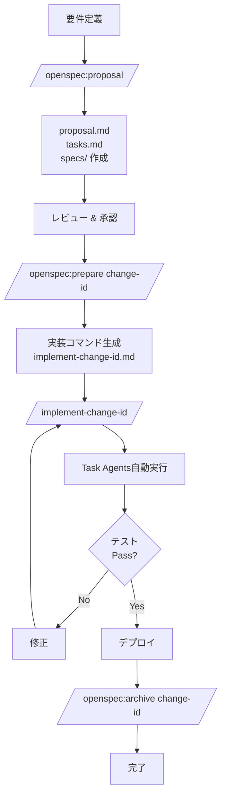

# OpenSpec 実装ワークフロー ガイド

このドキュメントでは、OpenSpecを使用した効率的な開発ワークフローについて説明します。

## 目次

1. [概要](#概要)
2. [開発フロー](#開発フロー)
3. [コマンドリファレンス](#コマンドリファレンス)
4. [実践例](#実践例)
5. [Tips & Tricks](#tips--tricks)

## 概要

OpenSpecは仕様駆動開発を支援するフレームワークです。このプロジェクトでは、Claude Codeのカスタムスラッシュコマンドを活用して、OpenSpecワークフローを自動化・効率化しています。

### 主要な概念

- **Change**: 新機能や変更の提案。`openspec/changes/<change-id>/` に格納
- **Spec**: 現在の仕様。`openspec/specs/<capability>/` に格納
- **Delta**: Changeにおける仕様の差分（ADDED/MODIFIED/REMOVED）
- **Archive**: 実装完了したChange。`openspec/changes/archive/` に移動

### ワークフローのステージ

```
提案 → レビュー → 実装準備 → 実装 → テスト → デプロイ → アーカイブ
 ↓       ↓         ↓         ↓      ↓       ↓        ↓
proposal apply   prepare  implement test   deploy  archive
```

## 開発フロー

### フロー1: 自動化実装（推奨）

複雑な機能追加や、複数領域にまたがる変更に最適です。



#### ステップ詳細

**1. 提案作成**
```bash
/openspec:proposal
```
- プロジェクト状態の確認
- change-idの決定
- proposal.md, tasks.md, spec deltas の作成
- Strict validation

**2. レビュー**
- チームメンバーによるレビュー
- 必要に応じて修正
- `openspec validate <change-id> --strict` で検証

**3. 実装準備**
```bash
/openspec:prepare <change-id>
```
実行内容：
- Changeの完全分析
- 実装スコープの判定（Frontend/Backend/Database/Test）
- Task agentの選択と順序決定
- 専用実装コマンドの生成

生成されるファイル：
```
.claude/commands/implement-<change-id>.md
```

**4. 実装実行**
```bash
/implement-<change-id>
```

実行フェーズ：
```
Phase 1: Exploration (並列)
├─ Explore Frontend structure
├─ Explore Backend APIs
└─ Review Database schema

Phase 2: Implementation (並列可能)
├─ Frontend implementation (frontend-refactoring-expert)
├─ Backend implementation (general-purpose)
└─ Database migration (general-purpose)

Phase 3: Testing (順次)
├─ npm test
├─ npm run lint
└─ Type check

Phase 4: Code Review (条件付き)
└─ Frontend code review (frontend-code-reviewer)
```

**5. デプロイ & アーカイブ**
```bash
# デプロイ後
/openspec:archive <change-id>
```

### フロー2: シンプル実装

単一ファイルの変更や、簡単なバグ修正に適しています。

```bash
# 1. 提案
/openspec:proposal

# 2. レビュー & 承認

# 3. 実装
/openspec:apply

# 4. アーカイブ
/openspec:archive <change-id>
```

## コマンドリファレンス

### `/openspec:proposal`

**目的**: 新しいOpenSpec changeを作成

**使用例**:
```bash
/openspec:proposal
```

**作成されるファイル**:
```
openspec/changes/<change-id>/
├── proposal.md      # なぜ・何を
├── tasks.md         # 実装タスク
├── design.md        # 技術的決定（オプション）
└── specs/
    └── <capability>/
        └── spec.md  # 仕様デルタ
```

**次のステップ**: レビュー → `/openspec:prepare`

---

### `/openspec:prepare <change-id>`

**目的**: Changeを分析し、実装用の専用コマンドを生成

**使用例**:
```bash
/openspec:prepare add-message-scheduling
```

**実行内容**:
1. ✅ Change存在確認
2. 📖 proposal/design/tasks/specs を全て読み込み
3. 🔍 実装スコープを分析
4. 🤖 必要なTask agentを決定
5. ⚡ 並列実行可能なタスクを特定
6. 📝 専用コマンドを生成

**生成されるコマンド**:
```
.claude/commands/implement-add-message-scheduling.md
```

**次のステップ**: `/implement-add-message-scheduling`

---

### `/implement-<change-id>`

**目的**: 生成された実装コマンドを実行

**使用例**:
```bash
/implement-add-message-scheduling
```

**実行フェーズ**:

| Phase | 内容 | 実行方式 |
|-------|------|----------|
| 1. Exploration | コードベース理解 | 並列 |
| 2. Implementation | コード実装 | 並列可能 |
| 3. Testing | テスト・検証 | 順次 |
| 4. Code Review | コードレビュー | 条件付き |

**使用されるAgent**:
- `Explore`: コードベース探索（thoroughness: medium）
- `frontend-refactoring-expert`: React/Next.js実装
- `frontend-code-reviewer`: フロントエンドレビュー
- `general-purpose`: Backend/Database/Test実装

**次のステップ**: デプロイ → `/openspec:archive`

---

### `/openspec:apply`

**目的**: Changeを直接実装（シンプルなケース向け）

**使用例**:
```bash
/openspec:apply
```

**使い分け**:
- Simple: `/openspec:apply`
- Complex: `/openspec:prepare` → `/implement-<change-id>`

---

### `/openspec:archive <change-id>`

**目的**: 実装完了したChangeをアーカイブ

**使用例**:
```bash
/openspec:archive add-message-scheduling
```

**実行内容**:
1. Change存在確認
2. `openspec archive <id> --yes` 実行
3. Specs更新
4. `changes/archive/YYYY-MM-DD-<id>/` に移動
5. Strict validation

## 実践例

### 例1: リッチメニュープレビュー機能

**要件**: リッチメニューの編集画面にプレビュー機能を追加

#### Step 1: 提案作成

```bash
/openspec:proposal
```

Assistant: proposal.md, tasks.md, spec deltas が作成されます。

#### Step 2: 実装準備

```bash
/openspec:prepare add-rich-menu-preview
```

#### Step 3: 実装実行

```bash
/implement-add-rich-menu-preview
```

実装の詳細は [openspec-examples.md](./openspec-examples.md) を参照してください。

---

## Tips & Tricks

詳細は [openspec-examples.md](./openspec-examples.md) の「Tips & Tricks」セクションを参照してください。

### クイックリファレンス

**いつ `/openspec:prepare` を使う？**
- ✅ 複数ドメインにまたがる変更
- ✅ 新機能追加
- ✅ データベーススキーマ変更
- ❌ 単一ファイルの修正
- ❌ CSSのみの変更

**Agent選択**:
- React/Next.js: `frontend-refactoring-expert`
- API/Backend: `general-purpose`
- Database: `general-purpose`
- Code Review: `frontend-code-reviewer`
- Exploration: `Explore (medium)`

---

## 参考ドキュメント

- [OpenSpec 実践例とTips](./openspec-examples.md) - 詳細な使用例とトラブルシューティング
- [OpenSpec Slash Commands README](../.claude/commands/openspec/README.md) - コマンドリファレンス
- [OpenSpec AGENTS.md](../openspec/AGENTS.md) - OpenSpec仕様の詳細
- [Project CLAUDE.md](../CLAUDE.md) - プロジェクト規約